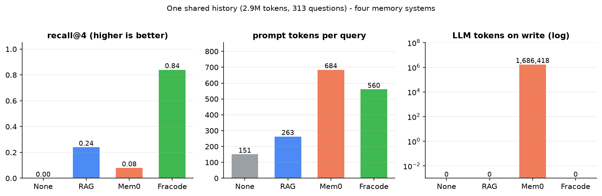

# Fracode MCP — long-term memory for agents at 24 bytes per token

[Russian](README.md) | [English](README.en.md)

My take on external long-term memory for LLM agents: the entire history of chats
and code lives in a compressed archive, the agent pulls context over MCP instead
of re-uploading history into the prompt.

## Where the idea came from

For a year I've been running a micro-model (STS-Prog, ~11M params) trained to
compress sequences — the experiment lives in this repo, branch `pc-carroll`.
The model learns to predict the next token through synchronous driver layers,
and its byproduct — a compact table of token embeddings — turned out to be an
excellent retrieval key. So this memory grew out of a model that learns to
compress, not out of a vector database that learns to search.

## Why

Context windows are paid, and agents pay for them again on every query. Vector
databases as agent memory mean heavy external services with billion-parameter
embedders. I wanted agent memory to be cheap: one file, no LLM calls on write,
tens of milliseconds per search, everything local.

## What you get (measured, not promised)

Bench on one shared slice of my real working history (2.9M tokens of dialogue,
313 questions with known needle answers) against RAG (chroma) and Mem0, same
chat model:



| | recall@4 | prompt tokens | search | LLM tokens on write |
|---|---|---|---|---|
| no memory | 0.00 | 151 | — | 0 |
| RAG (chroma) | 0.24 | 263 | 27 ms | 0 |
| Mem0 | 0.08 | 684 | 63 ms | 1,686,418 |
| **Fracode** | **0.84** | 560 | 41 ms | **0** |

Storage: 24 bytes per archive token. No external database, no LLM ingest calls —
the archive builds from plain text in minutes on CPU.

## How it works

1. **Archive** — BPE-tokenized text cut into windows; each window is quantized
   (product-quantizer over the micro-model embeddings) into a code sequence.
   `frakod_index_build.py`.
2. **Retrieval** — vector ADC screening over quantized keys plus a lexical exact
   layer: rare query words are matched as exact token-id subsequences in the
   archive, IDF-ranked. The hybrid (`/recall`, mode=auto) combines semantics and
   word precision. `frakod_api.py`.
3. **MCP** — stdio server `frakod_mcp.py` with seven tools
   (`remember`, `link`, `resolve`, `chain`, `recall`, `ask_llm`, `index_stats`).
   Attach from any MCP client:
   `{"mcpServers": {"frakod": {"command": "python", "args": ["frakod_mcp.py"]}}}`
4. **History portability** — `ingest_chat.py` imports chat exports from other
   agents (formats `a`/`b`/jsonl/txt) into the same archive: take your history
   from one agent, search it through another.

## Quick start

```bash
pip install -r requirements.txt
# 1) build the archive from your own text
FRK_CORPUS=my_history.txt FRK_OUTD=frakod_index python frakod_index_build.py
# 2) start the API (port 8781)
python -m uvicorn frakod_api:app --port 8781
# 3) point any MCP client at frakod_mcp.py
```

## Why it's cool

- Memory costs **24 B/token** and needs no database.
- Writing is **free**: zero LLM tokens per ingest (Mem0 spent 1.7M tokens and
  31 minutes on the same corpus).
- recall@4 = 0.84 on dialogue — 3.5x better than classic RAG on the same corpus.
- All local, GPL-3.0, readable in an evening: ~1.5k lines of python.
